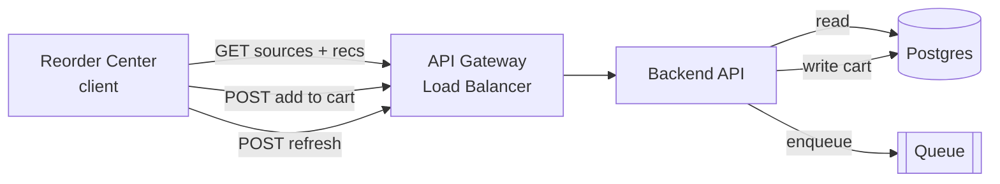
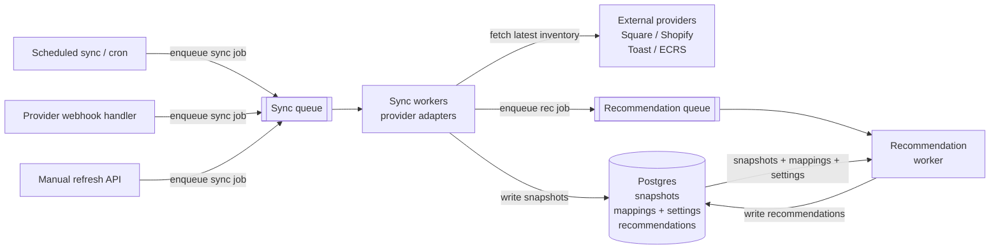


- [Airgoods Reorder Center - Mock](/work/inventory-reorder-design/mock_page.html)
- [Airgoods Reorder Center - Component Library](/work/inventory-reorder-design/component_sketches.html)


## Airgoods Reorder Center - Mock



## Airgoods Reorder Center - Component Library



Standalone pages:
- [Airgoods Reorder Center - Mock](/work/inventory-reorder-design/mock_page.html)
- [Airgoods Reorder Center - Component Library](/work/inventory-reorder-design/component_sketches.html)

## Requirements

### Functional requirements

Retailers should be able to:
- View connected inventory sources, such as Square POS, Shopify Online, Toast, or ECRS.
- See products that are out of stock, low stock, or nearing reorder threshold by source and location.
- See when each source was last synced and manually refresh a source.
- Review reorder recommendations, including current stock, reorder threshold, and suggested reorder quantity.
- Select one or more recommendations and add them to the Airgoods cart.
- Only show items in the main reorder table if they map to an orderable Airgoods product variant.

MVP assumption:
- `integration_product_data` includes enough metadata, such as SKU, UPC, barcode, or Airgoods product variant reference, to determine whether a source item maps to an orderable Airgoods variant.

### Non-functional requirements

- The Reorder Center should load quickly without waiting on live POS/ecommerce API calls during page render.
- Inventory freshness must be visible with `lastSyncedAt` per source.
- Inventory and recommendations must be scoped by `integration_connection_id` and `external_location_id`.
- Sync jobs should be retryable and tolerant of provider failures, rate limits, and outages.
- Add-to-cart should be idempotent so retries or double-clicks do not duplicate cart items.

### Out of scope

- Auto-submitting orders without retailer confirmation.
- Replacing the retailer’s POS inventory system.
- Advanced forecasting, proactive email/in-app notifications, manual mapping review, and reordering POS items Airgoods does not sell.

## Core entities

- User: authenticated Airgoods user.
- Retailer: buyer account using Airgoods.
- Seller: supplier or brand selling products through Airgoods.
- ProductVariant: exact orderable Airgoods item, including size, pack count, flavor, SKU, or sellable-unit details.
- IntegrationConnection: retailer-specific connected inventory source, such as Square, Shopify, Toast, or ECRS.
- InventorySnapshot: normalized inventory observation from an external source at a point in time.
- IntegrationProductData: external product and variant metadata from the retailer’s source catalog.
- ProductVariantMapping: reliable bridge from an external source item to an Airgoods product variant.
- ReorderSetting: threshold and target stock rule for a retailer, source, location, and item.
- ReorderRecommendation: computed low-stock or out-of-stock recommendation shown to the client.
- Cart: retailer’s active Airgoods cart.
- SyncLog: record of inventory sync attempts, provider errors, refreshes, and sync timestamps.

## API / System Interface

```http
GET /api/retailers/{retailerId}/inventory-sources
```

List connected inventory sources, sync status, enabled/paused state, and available locations.

```json
{
  "sources": [
    {
      "integrationConnectionId": "ic_square_123",
      "provider": "square",
      "displayName": "Square POS",
      "status": "active",
      "syncStatus": "active",
      "lastSyncedAt": "2026-07-01T21:12:00Z",
      "lastSyncError": null,
      "locations": [
        { "externalLocationId": "loc_main", "name": "Main Store" }
      ]
    }
  ]
}
```

---

```http
GET /api/retailers/{retailerId}/reorder-recommendations?integrationConnectionId=...&locationId=...&urgency=...
```

Get summary counts and low-stock recommendations for the main table.

```json
{
  "summary": {
    "outOfStockCount": 4,
    "lowInventoryCount": 18,
    "watchlistCount": 9
  },
  "items": [
    {
      "recommendationId": "rec_123",
      "productVariantId": "pv_123",
      "productName": "ZaZa Za'atar Pita Chips",
      "sellerName": "ZaZa Snacks",
      "integrationConnectionId": "ic_square_123",
      "sourceName": "Square POS",
      "externalLocationId": "loc_main",
      "locationName": "Main Store",
      "currentQuantity": 0,
      "reorderThreshold": 12,
      "recommendedQuantity": 48,
      "urgency": "out_of_stock"
    }
  ]
}
```

This endpoint only returns source items that reliably map to orderable Airgoods product variants. It does not return POS/source items Airgoods cannot sell.

---

```http
POST /api/retailers/{retailerId}/cart/items/bulk
```

Add selected recommendations to cart with chosen quantities.

```json
{
  "idempotencyKey": "idem_abc123",
  "items": [
    {
      "recommendationId": "rec_123",
      "productVariantId": "pv_123",
      "quantity": 48
    }
  ]
}
```

```json
{
  "cartId": "cart_123",
  "addedItemCount": 1,
  "skippedItems": []
}
```

---

```http
POST /api/retailers/{retailerId}/inventory-sources/{integrationConnectionId}/refresh
```

Manually enqueue an inventory refresh for one source.

```json
{
  "externalLocationId": "loc_main"
}
```

```json
{
  "syncJobId": "sync_123",
  "status": "queued"
}
```

After refresh, the client treats the response as asynchronous. It shows a syncing state, then polls `GET /inventory-sources` every few seconds until the source `syncStatus` changes from `syncing` to `active` or `failed`, or until `lastSyncedAt` updates. Once the sync completes, the client refetches `GET /reorder-recommendations`.

Manual refresh jobs should be prioritized over routine scheduled syncs. The backend should also dedupe queued/running syncs for the same source/location to avoid flooding provider APIs.

If the sync fails, the page keeps showing the last successful inventory snapshot and displays `lastSyncError` with a stale-data warning.

---

### Database tables


| Table | Purpose |
|---|---|
| `users` | Authenticated users and permissions. |
| `retailers` | Buyer accounts using Airgoods. |
| `sellers` | Brands/suppliers selling through Airgoods. |
| `products` | Airgoods catalog products. |
| `product_variants` | Orderable Airgoods variants/SKUs. |
| `orders` / `order_details` | Existing order history, useful later for reorder behavior and sales velocity. |
| `integrations` | Provider types, such as Square, Shopify, Toast, or ECRS. |
| `integration_connections` | Retailer-specific connected source with auth, provider, and sync status. |
| `integration_product_data` | External product metadata imported from connected sources, including fields used to map to Airgoods variants. |
| `inventory_snapshots` | Normalized inventory observations from connected sources. |
| `product_variant_mappings` | Reliable mappings from external source products/variants to Airgoods `product_variants`. |
| `inventory_reorder_settings` | Reorder thresholds and target stock levels by retailer/source/location/item. |
| `reorder_recommendations` | Computed low-stock recommendations shown in the Reorder Center. |
| `sync_logs` | Sync attempts, success/failure, provider errors, refreshes, and timestamps per source. |

---

```txt
inventory_snapshots
- id
- retailer_id
- integration_connection_id
- external_product_id
- external_variant_id
- external_location_id
- quantity_on_hand
- quantity_reserved
- quantity_available
- observed_at
- created_at
```

---

```txt
product_variant_mappings
- id
- retailer_id
- integration_connection_id
- external_product_id
- external_variant_id
- product_variant_id
- match_method -- sku | upc | barcode | explicit_reference
- created_at
- updated_at
```

---

```txt
reorder_recommendations
- id
- retailer_id
- integration_connection_id
- external_location_id
- product_variant_id
- current_quantity
- reorder_threshold
- recommended_quantity
- urgency -- out_of_stock | low | watchlist
- status -- active | dismissed | added_to_cart | expired
- generated_at
- expires_at
```

---

### Recommendation logic

For v1, I would use explainable threshold-based rules:

```txt
if quantity_available <= 0:
  urgency = out_of_stock
else if quantity_available <= reorder_threshold:
  urgency = low
else if quantity_available <= reorder_threshold * 1.5:
  urgency = watchlist
```

Definitions:
- Out of stock: `quantity_available <= 0`.
- Low stock: `quantity_available > 0` and `quantity_available <= reorder_threshold`.
- Watchlist: `quantity_available > reorder_threshold` and `quantity_available <= reorder_threshold * 1.5`.

Recommended quantity:

```txt
recommended_quantity = max(
  default_reorder_quantity,
  target_stock_level - quantity_available
)
```

This keeps v1 explainable; forecasting can be added later using sales velocity and order history.

### Frontend components

Visual component sketches are in [component_sketches.html](/work/inventory-reorder-design/component_sketches.html).

| Component | What it does |
|---|---|
| `ReorderCenterPage` | Owns page-level data fetching, selected filters, selected recommendation IDs, and layout. |
| `InventorySourceManager` | Shows connected sources, sync status, enabled/paused state, manual refresh buttons, and source selection. |
| `SyncStatusBanner` | Communicates freshness and stale/error states so users trust the inventory data. |
| `ReorderSummaryCards` | Gives a quick overview of inventory urgency and recommendation volume. |
| `ReorderFilters` | Lets retailers narrow recommendations when they have many products or locations. |
| `LowInventoryTable` | Displays only source items with reliable Airgoods product variant mappings that are safe to reorder. |
| `ReorderRecommendationRow` | Lets the retailer inspect and act on one recommendation. |
| `RecommendedQuantityControl` | Lets the retailer adjust the recommended reorder quantity before adding to cart. |
| `BulkReorderActionBar` | Lets the retailer add selected recommendations to cart in one action. |

## Data flows

### Page load / read flow

```txt
Retailer opens Reorder Center
  -> client calls GET /inventory-sources
  -> client calls GET /reorder-recommendations
  -> Backend API reads precomputed source status and recommendations from Postgres
  -> client renders source filters, sync freshness, summary cards, and low-stock table
```

The page does not call Square, Shopify, Toast, or ECRS directly during render.

### Background sync / recommendation flow

```txt
Scheduled sync, provider webhook, or manual refresh
  -> sync job is added to the queue
  -> sync worker calls the external provider API
  -> provider adapter normalizes inventory into Airgoods fields
  -> inventory snapshots are stored
  -> recommendation job is added to the queue
  -> recommendation worker joins snapshots, reliable mappings, and reorder settings
  -> reorder recommendations are written to Postgres
```

Items without a reliable Airgoods mapping are excluded from MVP reorder recommendations.

### Manual refresh flow

```txt
Retailer clicks Refresh on a source
  -> client calls POST /inventory-sources/{integrationConnectionId}/refresh
  -> Backend API validates access and enqueues a sync job
  -> API returns { syncJobId, status: "queued" }
  -> client shows syncing state and polls GET /inventory-sources
  -> when syncStatus becomes active/failed or lastSyncedAt changes, client refetches recommendations
```

If refresh fails, the client keeps showing the last successful snapshot and displays a stale-data warning.

### Add-to-cart flow

```txt
Retailer selects recommendations
  -> client calls POST /cart/items/bulk with recommendation IDs and quantities
  -> Backend API validates recommendation ownership and orderability
  -> Backend API writes cart items idempotently
  -> client shows updated cart state
```

## High-level design

### Path 1: user-facing read/action path



- Reads are served from stored source status and precomputed recommendations.
- Add-to-cart writes selected Airgoods product variants to the buyer account’s active cart.
- Manual refresh only enqueues work; it does not block on a live provider sync.

### Path 2: async sync/recommendation path



- Scheduled syncs, provider webhooks, and manual refreshes all enqueue sync jobs instead of doing provider work inline.
- Manual refresh jobs get higher priority than scheduled syncs and are deduped by source/location.
- The client reads from Airgoods snapshots/recommendations, so page render never blocks on live provider calls.

Key boundaries:
- External providers are the inventory source of truth.
- Airgoods stores snapshots and recommendations in Postgres.
- Only reliably mapped Airgoods variants are orderable.
